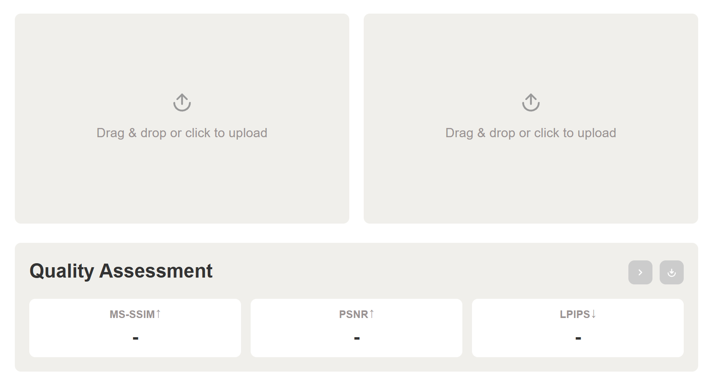

# Siming



# Project Overview

A web application for evaluating image quality generated by diffusion models. Supports MS-SSIM, PSNR, and LPIPS metrics calculation for comprehensive image quality assessment.

Once, Siming inscribed the fate of men; today, Siming judges the merit of generated images. The medium has changed, yet the pursuit of what is truly excellent remains the same.

## Features

### Image Upload
- Drag and drop image upload
- Support for batch upload of multiple images
- Click to upload single file or entire folder
- Image preview

### Quality Metrics Calculation
- **MS-SSIM** (Multi-Scale Structural Similarity) — Higher is better
- **PSNR** (Peak Signal-to-Noise Ratio) — Higher is better
- **LPIPS** (Learned Perceptual Image Patch Similarity) — Lower is better

### Comparison Modes
- **Single Image Comparison** — Upload a pair of images for assessment
- **Multi-Image Comparison** — Batch upload multiple images, system auto-sorts by name and pairs them for comparison

### Report Export
- **Summary Report** — Image preview + average metrics
- **Data Table** — CSV format with averages and standard deviations

## Tech Stack

- **Backend**: Python Flask
- **Frontend**: HTML5 + JavaScript
- **Image Processing**: OpenCV, Pillow, NumPy, SciPy
- **Deep Learning**: PyTorch
- **Report Generation**: html2canvas

## Metrics Implementation

### MS-SSIM
Custom 5-scale implementation using a Gaussian pyramid. Each scale computes SSIM using an 11×11 Gaussian window (σ=1.5) via `cv2.filter2D`, then downsamples with `scipy.ndimage.gaussian_filter` (σ=1.5). Final score is the weighted product across scales:

```
weights = [0.0448, 0.2856, 0.3001, 0.2363, 0.1333]
MS-SSIM = ∏ SSIM_i ^ weight_i
```

Constants: C1 = (0.01×255)², C2 = (0.03×255)²

### PSNR
MSE-based computation on RGB pixel values in [0, 255]:

```
PSNR = 20 × log10(255 / √MSE)
```

Returns 100.0 when images are identical (MSE = 0).

### LPIPS
Uses the `lpips` library with a VGG backbone. Input images are normalized to [−1, 1] before inference. Lower values indicate greater perceptual similarity.

## API

### `POST /api/compare-base64`

Request body (JSON):

| Field | Description |
|---|---|
| `generate` | Base64-encoded Gen image (left panel) |
| `reference` | Base64-encoded Ref image (right panel) |

Response:

```json
{
  "metrics": {
    "msssim": 0.987654,
    "psnr": 38.52,
    "lpips": 0.012345
  }
}
```

If the two images differ in size, the reference image is resized to match the generated image using Lanczos resampling before metric computation.

# Quick Start

## Install Dependencies

```bash
pip install -r requirements.txt
```

## Run

Double-click `start.bat` to run, or manually execute:

```bash
python app.py
```

Then open http://localhost:5000 in your browser

## Project Structure

```
├── app.py              # Flask backend — metric computation and API
├── requirements.txt    # Python dependencies
├── start.bat           # Windows startup script
├── README.md           # Project documentation
├── static/
│   └── css/
│       └── style.css   # Stylesheet
├── templates/
│   └── index.html      # Frontend page
```

## Usage

1. After starting the application, the page is divided into left and right panels
2. **Left (Gen)**: Upload generated images
3. **Right (Ref)**: Upload reference / target images
4. Click **Start** to compute quality metrics
5. After assessment completes, click the download button to export results

### Batch Upload
- Drag and drop a folder onto either panel
- System auto-sorts files by name (natural sort) and pairs them by index
- Exports a summary report image and a CSV data table

## Dependencies

| Package | Purpose |
|---|---|
| Flask | Web framework |
| flask-cors | CORS headers |
| Pillow | Image I/O |
| NumPy | Numerical computation |
| SciPy | Gaussian filter for MS-SSIM pyramid |
| OpenCV | Gaussian window filtering for SSIM |
| PyTorch | Tensor operations for LPIPS |
| lpips | Perceptual similarity (VGG) |
